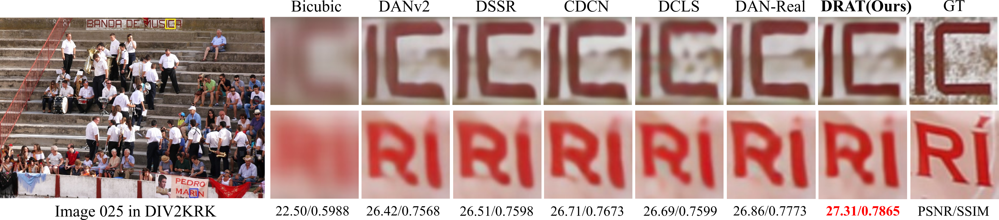

## [✨AAAI 2025] DRAT: Unsupervised Degradation Representation Aware Transform for Real-World Blind Image Super-Resolution
> [Sen Chen](https://github.com/KKKc3231), Hongying Liu, Chaowei Fang, Fanhua Shang, Yuanyuan Liu, Liang Wan, Dongmei Jiang, Yaowei Wang

> School of Artiffcial Intelligence, Xidian University
## News:
- Our **DRAT** is accepted by AAAI2025✨!
  
## Overview of DRAT
 

## Environment
This code is based on basicsr.

- python >= 3.9
- pytorch == 1.13.1
```sh
conda env create -n DRAT -f environment.yml

python setup.py develop
```

## Code File Descriptions

| File                                      | Description                                                  |
| ----------------------------------------- | ------------------------------------------------------------ |
| basicsr/archs/drat_arch.py                | Implementation of DRAT.                                      |
| basicsr/add/encoder.py                    | Implementation of aux and blur encoder.                      |
| basicsr/losses/basic_loss.py              | Definitions of the loss functions.                           |
| degradation/scripts/                      | Code for generating training and test data for Isotropic, Anisotropic Gaussian kernels and complex degradations.|
| inference/inference_drat.py               | Code for inferring Super-Resolution (SR) results by using DRAT. |
| options/test/xxx/xxx.yml                  | YML configuration file for testing.                          |
| options/train/xxx/xxx.yml                 | YML configuration file for training.                         |
| basicsr/utils.py                          | Various utilities.                                           |
| options/train/xxx/xxx.yml                 | YML configuration file for training.                         |
| moco/                                     | Using MoCo to train Encoder for degradation representation learning                           |
| checkpoints/                              | Pretrained models                          |

You can use the following commands to train and test:

## Dataset Prearation
- We use DIV2K and Flickr2K as our training datasets (totally 3450 images). 

- For more details about the dataset, please see [DatasetPreparation](https://github.com/XPixelGroup/BasicSR/blob/master/docs/DatasetPreparation.md), which has a detailed introduction.

- For Anisotropic Gaussian kernels degradation, you can download DIV2KRK test datasets from [DIV2KRK](https://data.vision.ee.ethz.ch/cvl/DIV2K/).

- For real-world degradation test, you can download the [RealSR_V3(Nikon and Canon)](https://drive.google.com/file/d/17ZMjo-zwFouxnm_aFM6CUHBwgRrLZqIM/view), [DRealSR](https://drive.google.com/drive/folders/1_EjDsD2-bBXb0iRonbWI6ihuHquxdna1) and [ImageNet256_x4_sr](https://drive.google.com/file/d/1NhmpON2dB2LjManfX6uIj8Pj_Jx6N-6l/view) (from ResShift)
```python
cd degradation/scripts/
python extract_subimages.py # crop the images to subimages

# getting degradation training data
python generate_blur_traindata.py # for iso/aniso blind sr (for training)
python generate_realesrgan_data.py # for real-world sr (for training)
python generate_blur_testdata.py # for generate iso/aniso test datasets
```
## Pretrained Model
- You can download pretrained models from [Pretrained_DRAT](https://drive.google.com/drive/folders/1HIetPN7adkjNbgaEZiwNjXiop3TManOs?usp=sharing)
## Train
- The alorithm is in `archs/drat_arch.py`.
- Please Modify `options/train/SettingX/xx.yml` to set path, iterations, and other parameters.
- To train the DRAT, run the commands below.
```python
python train.py -opt=options/train/DRAT/setting1/x4/train_DRAT_x4.yml
python train.py -opt=options/train/DRAT/setting2/x4/train_DRAT_div2krkx2.yml
python train.py -opt=options/train/DRAT/setting3/x4/train_DRATGAN.yml
```

# Test & Infer
- Before test, please modify the model and data path.
- To test the DRAT, run the commands below.
```python
python test.py -opt=options/test/DRAT/setting1/x4/test_urban100.yml
python test.py -opt=options/test/DRAT/setting2/x4/test_div2krkx4.yml
python test.py -opt=options/test/DRAT/setting2/x4/test_DRATGAN.yml
```
- To infer DRAT on other image folders.
- To infer the DRAT, run the commands below.
- cd `inference/`
```python
python inference_drat.py --input your_input_path --output your_save_path
```
## Result
### Comparison of Isotropic Gaussian Kernels (Gaussian8)
 
 
### Comparison of Anisotropic Gaussian Kernels (DIV2KRK)
 
 
### Comparison of Real-World Degradation (RealSR)
 
 
### Other Super-Resolution Visualization
 

## Citations
If our code helps your research or work, please consider citing our paper. The following is a BibTeX reference.
```
@inproceedings{hqqh✨,
  title={Unsupervised Degradation Representation Aware Transform for Real-World Blind Image Super-Resolution},
  author={Snd},
  booktitle={这棵🌳成精后，天天求我教它跳广场舞},
  pages={1818-8984},
  year={2025}
}
```
## Contact
If you have any questions, please feel free to reach me out at `23171214481@stu.xidian.edu.cn`.

## Acknowledgement
Our projects is based on [DASR](https://github.com/csjliang/DASR), [DCLS](https://github.com/megvii-research/DCLS-SR?tab=readme-ov-file) and [BasicSR](https://github.com/XPixelGroup/BasicSR). Thanks for their awesome works.  
